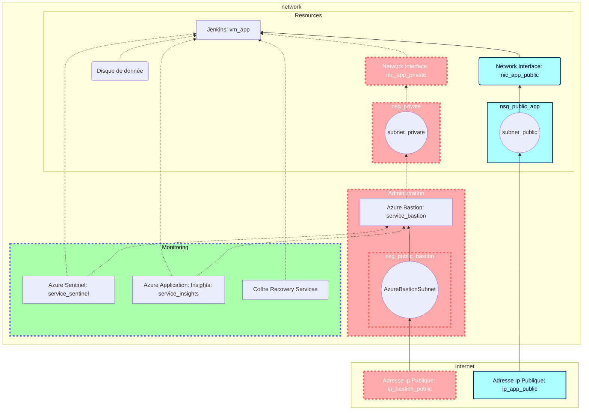

# Brief 3

- [Brief 3](#brief-3)
  - [1 Plan d'action.](#1-plan-daction)
    - [1.1 Topologie de l'infrastructure.](#11-topologie-de-linfrastructure)
    - [1.2 Liste des ressources.](#12-liste-des-ressources)
    - [1.3 Liste des tâches.](#13-liste-des-tâches)

Réalisé par : Alain, Noa, Paul et Quentin

## 1 Plan d'action.

### 1.1 Topologie de l'infrastructure.

### 1.2 Liste des ressources.

| Nom | Type | Description | Annotation |
| -------- | -------- | -------- | - |
|   BRIEF_3  | Resource group |      | |
| vnet_3     | Virtual Network | Réseau virtuel | Réseau virtuel contenant toute l'infrastructure |
| AzureBastionSubnet | Virtual Network | Sous-réseau réservé au Bastion    | Réseau virtuel réservé au bastion |
| PrivateSubnet     | Virtual Network     | Carte réseau permettant la communication entre la machine applicative et le bastion    | Contient l'application |
| AppSubnet  | Virtual Network    | Carte réseau permettant la connection HTTP des utilisateurs     |  |
| public_ip_app | Public IP address |  |IP Publique permettant l'accès depuis le navigatteur en HTTPS |
| public_ip_bas | Public IP address |  | IP Publique du bastion|
| nsg_public_bas     | Network Security Group   |      | |
| nsg_private    | Network Security Group     |      | |
| nsg_public_app     | Network Security Group     |      | |
| nic_app_public    | Network Interface  |      |  |
| nic_app_private    | Network Interface  |      | Permet la communication en SSH |
| disk_app | Disk | Support de stockage pour la machine virtuelle applicative| |
| vm_appli | Virtual Machine | Machine virtuelle contenant l'application Jenkins |
| Sentinel | Azure Sentinel| |
| Insight | Azure Insight | |
| Vault | Coffre Recovery Service |  |

### 1.3 Liste des tâches.
- [ ] Planifier les actions et quelles ressources mettre en place.

    - [x] Créer la topologie de l'infrastructure
    - [x] Lister les ressources
    - [x] Lister les tâches
    - [x] Assigner les tâches
    - [x] Quel langage utiliser pour le scripting ? --> **Python**

- [x] Production du script python d'automatisation du déploiement de l'infrastructure.
    - [x] Période de reflexion
        - [ ] Sélection des différentes commandes ainsi que l'ordre dans lequel elle seront appelées
        - [ ] Préparation du script : mise en place de l'architecture du programme
    - [x] Rédaction du script
    - [x] Test du script
    - [x] Rédaction de la documentation

- [x] Production du script python d'automatisation de l'installation de l'application et ses dépendances
    - [x] Période de reflexion.
        - [x] Sélection des différentes commandes ainsi que l'ordre dans lequel elle seront appelées
            - [x] Installation de certbot
            - [x] Rétention des logs
            - [x] Publication des clés publiques (ssh)
    - [x] Rédaction du script
    - [x] Test du script
    - [x] Rédaction de la documentation

<!--
[Lien vers doc Microsoft pour déployer Bastion](https://docs.microsoft.com/en-us/azure/bastion/create-host-cli)
Penser au --help :

[Doc commande créa / chargement ssh](https://docs.microsoft.com/fr-fr/azure/virtual-machines/ssh-keys-azure-cli)

https://docs.microsoft.com/fr-fr/azure/developer/jenkins/configure-on-linux-vm
-->
