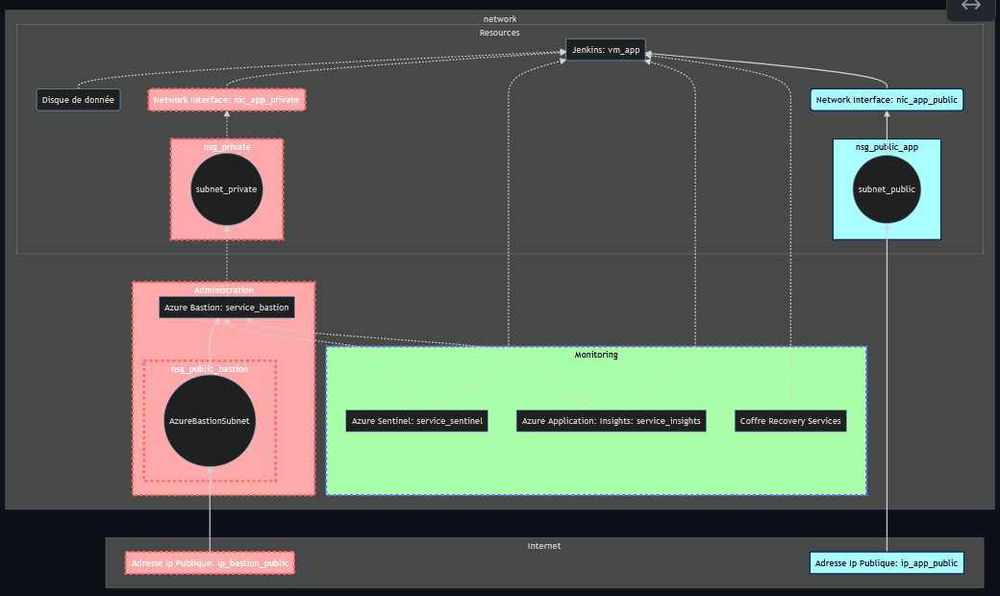

# 1. Introduction.
**Jenkins.**
**Azure.**
**Python.**
*Mise en place par Paul et Quentin.*

---
# Sommaire
* 1 Introduction.
* 2 Missions.
* 3 Objectifs.
* 4 Ressouces.
* 5 Déploiment de l'infrastructure.
* 6 Installation de l'application et ses dépendances.
* 7 Retrospective du sprint.

---
# 2. Mission.
Bonjour,
Tu as bien travaillé pour le Nextcloud de Lifesense, merci !
J'ai regardé les demandes de déploiements d'applications et j'ai remarqué qu'il y a beaucoup de tickets qui
concernent ces 3 applications : Nextcloud, Gitea et Jenkins.
On pourrait gagner beaucoup de temps à les automatiser !
Est-ce que tu peux en choisir une et préparer un script de déploiement complètement automatisé ?
Je compte sur toi.
Cordialement,
Le chef

---
# 3. Objectifs.
# 3.1 Managements.
* Présenté votre travail
* Pratiqué Scrum
* Abordé la gestion de projet
* Abordé la communication en équipe
* Mieux anticipé vos actions que dans le brief précédent

---
# 3. Objectifs.
# 3.1 Techniques.
* Déployé de nouvelles ressources dans Azure
* Implémenté des scripts
* Utilisé un bastion
* Mis en place un moyen de surveillance de la disponibilité de l'application
* Configuré la rétention des logs
* Parsé du JSON
* Utilisé certbot pour déployer un certificat TLS

---
# 3. Topologie infrastructure.

---
# 4. Ressources.
* Un groupe de ressource azure.
* Un réseau. (10.0.1.0/24)
* Deux sous-réseaux. (Bastion: 10.0.1.0/26 App: 10.0.1.64/26)
* Deux ip publiques.
* Deux groupes de sécurité réseau.
* Deux cartes réseaux.
* Disque additionnel.
* Une machine virtuelle linux ubuntuLTS.
* Un service Insight.

---
# 5. Déploiment de l'infrastructure.
## 5.1 Outils:
* Utilisation de Python.
* Utlisation d'Azure CLI.

---
# 5. Déploiment de l'infrastructure.
## 5.2 Organisation du code:
* Fonctions
* Main process

---
# 5. Déploiment de l'infrastructure.
## 5.3 Difficultés:
* Installation de bastion.
* Activation du tunnel sur bastion.
* Utilisation du tunnel.
* Problème de size indisponible.
* Paramiko.

---
# 6. Installation de l'application et ses dépendances
## 6.1 Outils:
* Python.
* Paramiko.
    * ssh.
    * open_sftp.
* Nginx.
* Jenkins.
* Certbot.
* Regex.

---
# 6. Installation de l'application et ses dépendances
## 6.2 Organisation du code:
* Fonction.
* Main process
* Fichier de configuration.

---
# 6. Installation de l'application et ses dépendances
## 6.3 Difficultés:

* Paramétrages du port d'écoute de l'application Jenkins.
* Paramétrage du certificat TLS.
    * Installation certbot.
    * Problème de sur-utlisation du fqdn.

---
# 7 Retrospective du sprint.
# 7.1 Qu'est ce qui c'est bien passé ?
* On a bien échangé sur les différents problémes que l'on a rencontré.
* On a partagé et on s'est soutenu tout le long du projet.
* On a travaillé ensemble sur la partie deploiment de l'infrastructure et sur le début de la rédaction du projet.

---
# 7 Retrospective du sprint.
# 2. Qu'est ce qui ne c'est pas bien passé ?
* On a fais le projet chacun de notre coté, on n'a pas assez travaillé ensemble. Du coup on a perdu beaucoup de temps alors que si on avait étè plus collaboratif on aurait pu tout faire et bien plus.
* Répartition des taches. Il était difficile de répartir les taches car tout le monde voulait tout voir pour pouvoir apprendre.
* Sur la partie deploiment de l'application nous avons utilisé des stratégies différentes ce qui a rendu la collaboration difficile.
* Scrum: Néccésité d'avoir le même scrum master tout le long du processus pour organiser les tâches, le timming, et la communication dans le groupe.